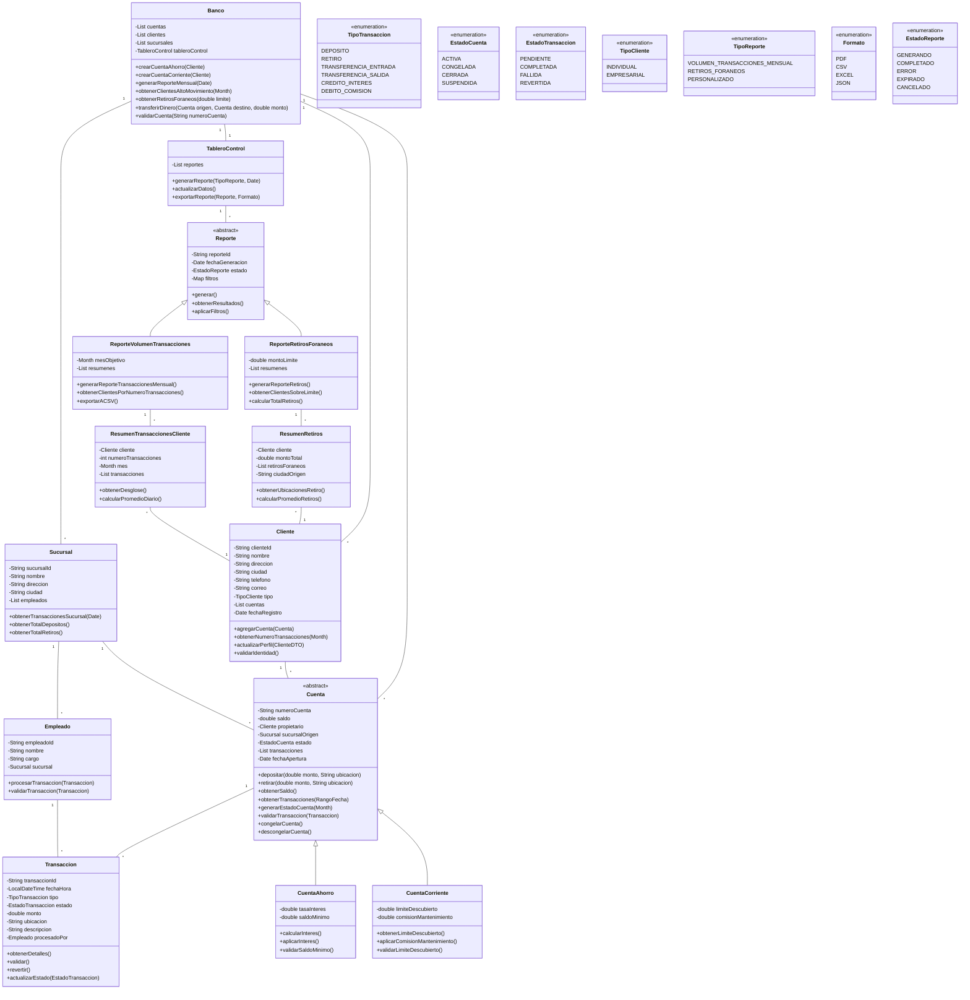

# Bank terminal v0
Bank App is a comprehensive financial management application built with .NET, Angular, Docker, and Kubernetes. It offers users a seamless and secure platform to manage their banking needs, including account management, transaction tracking, and personalized financial insights. The app leverages modern web technologies to provide a robust and scalable solution, ensuring high availability and performance.
# Class Diagram

